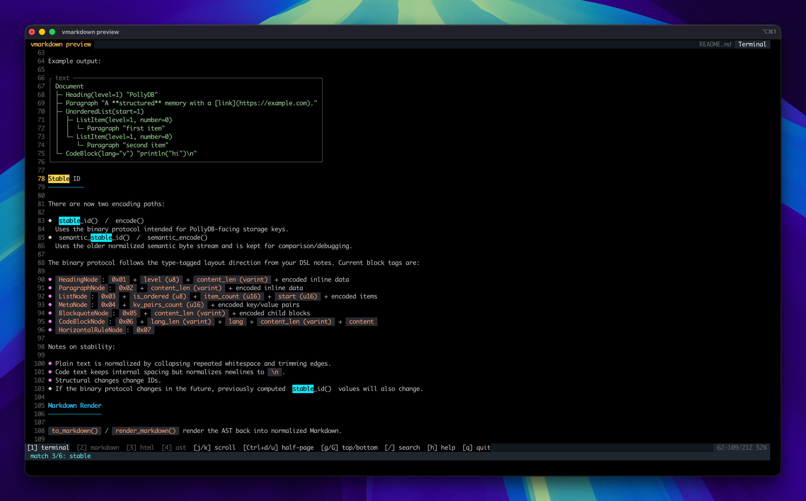

# vmarkdown


`vmarkdown` is a V wrapper around [md4c](https://github.com/mity/md4c) that builds a typed Markdown AST instead of only streaming HTML.

## Why this shape

The public AST follows the DSL direction from your sketch:

- `Document` owns `[]BlockNode`
- `BlockNode` is a V `sum type`
- `InlineNode` is a V `sum type`

One deliberate adjustment was made for production parsing: `ListItemNode.children` uses `[]BlockNode` instead of `[]InlineNode`. `md4c` can emit multi-block list items, nested lists, and paragraphs inside a single list item, so this keeps the AST lossless.

## Layout

- `src/ast.v`: AST types
- `src/parser.v`: md4c-backed parser and event builder
- `src/validate.v`: recursive AST invariant validation
- `src/binary_codec.v`: bounded decoder for the versioned binary AST format
- `src/serialize.v`: normalized stable IDs, chunk collection, and in-memory incremental ingest
- `src/render.v`: HTML, plain-text, and JSON renderers
- `src/ascii_layout.v`: reusable terminal layout primitives
- `src/ascii_diagrams.v`: flow / graph ASCII renderers built on `ascii_layout`
- `src/ascii_diagrams_tree_org.v`: tree and org-chart ASCII renderers
- `src/ascii_diagrams_misc.v`: timeline, pipeline, state, journey, and git ASCII renderers
- `src/diagram_ast.v`: shared lower-level diagram AST / IR
- `src/diagram_schema.v`: internal JSON schema, validation, and decoding
- `src/diagram_bridge.v`: Mermaid AST -> shared diagram AST bridge
- `src/c/md4c_bridge.c`: thin callback adapter
- `thirdparty/md4c`: vendored upstream parser

## Diagram Architecture

Terminal diagrams are now split into three explicit layers:

1. Mermaid syntax layer
   - `Mermaid source -> Mermaid AST`
2. Shared diagram IR layer
   - `Mermaid AST -> Diagram AST`
   - `vmarkdown` internal JSON schema -> `Diagram AST`
3. Terminal layout/render layer
   - `Diagram AST -> ascii_layout -> terminal ASCII/Unicode output`

This keeps Mermaid-specific parsing separate from the reusable lower-level diagram model and makes grouped flow, timeline, state, org, and other terminal renderers easier to share.

## Quick Start

```v
import vmarkdown

doc := vmarkdown.parse('# hello\n\nworld')!
println(doc.stable_id())
```

`parse()` keeps the established GFM-oriented defaults. For an explicit and
stable dialect contract, use `parse_with_dialect(markdown, .commonmark)` or
`parse_with_dialect(markdown, .gfm)`. Lower-level feature switches remain
available through `parse_with_options()`.

Text parsing is bounded by default, matching the defensive posture of binary
decoding: 64 MiB input, one million AST nodes, and 256 open nesting frames.
Applications handling untrusted input can tighten any budget:

```v
doc := vmarkdown.parse_with_limits(markdown, vmarkdown.ParseOptions{}, vmarkdown.ParseLimits{
	max_input_bytes: 1024 * 1024
	max_nodes: 100_000
	max_nesting_depth: 64
})!
```

A limit set to `0` is unbounded. Negative limits are rejected.

Run the bundled example with:

```sh
v run examples/basic.v
```

Rendering helpers:

```v
html := vmarkdown.render_html(markdown)!
text := vmarkdown.render_text(markdown)!
json := vmarkdown.render_json(markdown)!
normalized_markdown := vmarkdown.render_markdown(markdown)!
markdown_from_html := vmarkdown.html_to_markdown(html)!
terminal_view := vmarkdown.render_terminal(markdown)!
```

AST pretty printing:

```v
doc := vmarkdown.parse(markdown)!
println(doc.pretty())
```

Example output:

```text
Document
├─ Heading(level=1) "PollyDB"
├─ Paragraph "A **structured** memory with a [link](https://example.com)."
├─ UnorderedList(start=1)
│  ├─ ListItem(level=1, number=0)
│  │  └─ Paragraph "first item"
│  └─ ListItem(level=1, number=0)
│     └─ Paragraph "second item"
└─ CodeBlock(lang="v") "println("hi")\n"
```

## Stable ID

There are now two encoding paths:

- `stable_id()` / `encode()`
  Uses the binary protocol intended for PollyDB-facing storage keys.
- `semantic_stable_id()` / `semantic_encode()`
  Uses the older normalized semantic byte stream and is kept for comparison/debugging.

Document encodings start with the `VMDA` magic and a format version. Version 1
uses canonical unsigned varints for every length, count, and non-negative
integer, so values cannot be silently truncated to 16 bits. Decode with
`vmarkdown.binary_decode(bytes)!`. The complete contract and tag table are in
[`BINARY_FORMAT.md`](BINARY_FORMAT.md).

Current block tags are:

- `HeadingNode`: `0x01` + `level (u8)` + `content_len (varint)` + encoded inline data
- `ParagraphNode`: `0x02` + `content_len (varint)` + encoded inline data
- `ListNode`: `0x03` + `is_ordered (u8)` + `item_count (varint)` + `start (varint)` + encoded items
- `MetaNode`: `0x04` + `kv_pairs_count (varint)` + encoded key/value pairs
- `BlockquoteNode`: `0x05` + `content_len (varint)` + encoded child blocks
- `CodeBlockNode`: `0x06` + `lang_len (varint)` + `lang` + `content_len (varint)` + `content`
- `HorizontalRuleNode`: `0x07`
- `TableNode`: `0x08` + column/header/body counts + length-prefixed rows and cells
- `RawHtmlBlockNode`: `0x09` + length-prefixed verbatim HTML

Notes on stability:

- Plain text is normalized by collapsing repeated whitespace and trimming edges.
- Code text keeps internal spacing but normalizes newlines to `\n`.
- Structural changes change IDs.
- Source spans are deliberately excluded from encoding and stable IDs.
- Future incompatible changes require a new format version and will change `stable_id()` values.

## AST source spans and raw HTML

Parsed documents and semantic nodes expose `SourceSpan`, a half-open UTF-8 byte
range into the original Markdown. A negative start means md4c emitted no
source-bearing callback for that node. Preview block mapping uses these spans
as its primary boundary source, with syntax scanning only as a fallback for
source-less nodes such as thematic breaks.

For container nodes, the span covers the source-bearing child content exposed
by md4c; Markdown delimiters that do not produce callbacks may sit immediately
outside the range. `BlockNode.source_span()` and `InlineNode.source_span()`
provide uniform access without a sum-type match.

Task state, strikethrough, soft breaks, and hard breaks have explicit AST
representations. Raw HTML is represented by `RawHtmlBlockNode` and
`RawHtmlInlineNode`; it is preserved verbatim and is neither interpreted nor
sanitized by the AST parser.

`render_html()` also preserves raw HTML through md4c and therefore returns
unsanitized output. Sanitize the result before embedding Markdown from an
untrusted source into a web page.

## AST validation

Parsed documents, standalone blocks, and standalone inline nodes expose
`validate()!`. Validation is especially useful before encoding or rendering an
AST assembled by application code:

```v
doc.validate()!
bytes := doc.binary_encode()
```

The validator checks renderer and stable-ID invariants such as heading levels,
canonical list levels and numbers, task state, table dimensions, metadata key
collisions after normalization, adjacent or empty text nodes, non-empty
emphasis containers, nested links, code-fence info lines, and source-span
shape. Validation itself is bounded to one million nodes and 256 levels.

`binary_decode()` validates the reconstructed AST before returning it, so a
well-framed payload with invalid semantic state is rejected as an invalid
binary AST. `MemoryStore.ingest_document()` applies the same check before
writing chunks. Custom stores can use `plan_ingest_document_checked()` when
planning ingestion of application-assembled ASTs; the original non-fallible
planner remains available for already validated or parser-produced documents.

## Markdown Render

`to_markdown()` / `render_markdown()` render the AST back into normalized Markdown.

- This is semantic round-trip, not source-exact round-trip.
- Output formatting is normalized.
- Original trivia like exact blank lines, marker style, or emphasis delimiter choice is not preserved.
- The renderer is covered for nested lists, blockquotes, GFM tables, mixed list-item blocks,
  complex link/image destinations, and code span/code fence delimiter safety.

## Conformance and performance baselines

The test suite checks structural Markdown round trips against 690 vendored md4c
examples: the CommonMark corpus plus tables, task lists, strikethrough,
hard/soft breaks, and permissive autolinks. Each example must preserve its
versioned `stable_id()` after parse, normalized Markdown render, and reparse.

Run the conformance gate with:

```sh
v test src/conformance_test.v
```

The large-document smoke benchmark exercises parse, Markdown render, reparse,
and structural identity over a deterministic generated document:

```sh
v run bench/roundtrip.v
```

CI allows a deliberately broad 15-second runtime budget so the check catches
catastrophic regressions without treating shared-runner noise as a precise
microbenchmark.

## HTML To Markdown

`html_to_markdown()` parses HTML with V's `net.html` module and converts a supported HTML subset back into normalized Markdown.

- Intended for clean HTML and especially the HTML produced by `render_html()`
- Supports headings, paragraphs, blockquotes, lists, links, images, `pre/code`, `strong/em`, `hr`, and `br`
- Unsupported tags are best-effort flattened to their children/text

## Terminal Render

`render_terminal()` and `doc.to_terminal()` provide a lightweight ANSI-colored terminal preview built on V's `term` module.

Terminal rendering replaces user-provided C0/C1 control characters with visible
or inert Unicode characters by default, preventing Markdown text, code, links,
and raw HTML from injecting terminal escape sequences. Trusted callers can opt
out with `TerminalRenderOptions{sanitize_control_sequences: false}`.



- Heading, list, blockquote, code block, link, and image placeholder styling
- Mermaid `flowchart` / `graph` code blocks can render as ASCII/Unicode diagrams in terminal
- Internal schema diagrams can also render from fenced JSON blocks using info strings like ````json diagram````
- Width-aware wrapping
- No heavy external renderer dependency
- Pairs with the interactive `preview()` viewer below

Example:

```md
```json diagram
{
  "version": 1,
  "kind": "timeline",
  "entries": [
    { "point": "2024", "text": "Parser" },
    { "point": "2025", "text": "Preview" }
  ]
}
```
```

Try it with:

```sh
v run examples/json_diagram.v
```

## Mermaid In Terminal

Mermaid support is implemented in pure V and rendered directly into terminal-friendly ASCII/Unicode layouts.

Current support is intentionally limited but extensible:

- `flowchart` / `graph`
- `sequenceDiagram`
- `stateDiagram-v2`
- `classDiagram`
- `erDiagram`
- `gantt`
- `mindmap`
- `journey`
- `gitGraph`
- `timeline`
- `TD` / `TB` / `LR`
- Nodes like `A`, `A[Label]`, `A(Label)`, `A{Decision}`
- Edges `-->`, `---`, and `-->|label|`
- Chained paths like `A --> B --> C`
- Simple branches like `A --> B & C`
- Basic `subgraph ... end` grouping
- Sequence messages like `Alice->>Bob: hello`
- Sequence notes like `Note left/right of Bob: ...`
- Sequence activation markers with `activate` / `deactivate`
- Sequence control blocks like `alt`, `opt`, and `loop`
- Sequence `else` / `par` branches and self messages like `Bob->>Bob: cache`
- State transitions like `[*] --> Idle` and `Idle --> Running: start`
- Class boxes with member lists plus common relations like `<|--`, `-->`, and `--`
- ER entity boxes with attribute lists plus cardinality relations like `||--o{`
- Gantt sections and tasks with status markers like `done` and `active`
- Mindmap trees rendered as indented branch layouts
- Journey sections and scored steps with compact progress dots
- GitGraph commits, branches, checkouts, and merges
- Timeline titles, dated milestones, and continued events

Unsupported Mermaid syntax currently falls back to a normal fenced code block instead of failing preview.

Try the dedicated Mermaid example with:

```sh
v run examples/mermaid.v
```

## Generic ASCII Diagrams

`ascii_layout` is now also reused outside Mermaid for small terminal-native diagrams.

- `render_ascii_tree(root, width)`
- `render_ascii_dependency_graph(edges, width)`
- `render_ascii_call_graph(edges, width)`
- `render_ascii_org_chart(root, width)`
- `render_ascii_timeline(entries, width)`
- `render_ascii_pipeline(stages, width)`
- `render_ascii_state_machine(transitions, width)`

Try the standalone diagram example with:

```sh
v run examples/ascii_diagrams.v
vmarkdown diagrams-demo
vmarkdown diagram dependency
vmarkdown diagram org
```

You can also pass a JSON file to `diagram`.

These JSON payloads are a `vmarkdown`-internal diagram schema for the generic ASCII diagram CLI. They are not Mermaid JSON, Graphviz DOT, Vega, or another industry-standard chart schema.

`diagram validate` checks decoded payloads for required fields and reports path-like errors such as `root.reports[0].name cannot be empty`.
`diagram schema <kind>` now prints required fields, optional fields, and an example payload shape for each supported kind.
Validation is intentionally a little stricter than plain JSON decoding: duplicate graph edges, self loops, empty timeline labels, and invalid pipeline statuses are rejected early.
The generic diagram schema is now versioned. `version: 1` is accepted when present, and omitted `version` currently defaults to the v1 shape.

The schema is intentionally a `vmarkdown` internal protocol, not a Mermaid, DOT, or Vega-compatible interchange format. The stable contract here is:

- `diagram_schema.v` defines decode/validate rules
- `diagram_ast.v` defines the shared in-memory IR
- `ascii_diagrams.v` renders that IR
- `diagram_bridge.v` lets Mermaid reuse the same lower-level IR where the mapping is clean

The Mermaid bridge now routes these diagram kinds through the shared `Diagram AST` and generic ASCII renderers:

- `flowchart` / `graph` (safe shared subset)
- `sequenceDiagram`
- `stateDiagram-v2`
- `classDiagram`
- `erDiagram`
- `gantt`
- `mindmap`
- `journey`
- `gitGraph`
- `timeline`

```sh
vmarkdown diagram timeline examples/diagrams/timeline.json
vmarkdown diagram org examples/diagrams/org.json
vmarkdown diagram dependency examples/diagrams/dependency.json
vmarkdown diagram dependency examples/diagrams/dependency.json --width 56
vmarkdown diagram validate org examples/diagrams/org.json
vmarkdown diagram diff timeline before.json after.json
vmarkdown diagram diff-preview timeline before.json after.json
vmarkdown diagram schema all
vmarkdown diagram schema org
```

`diagram diff` compares two payloads after decode/validation and reports path-level semantic changes such as:

```text
reused timeline_entry at entries[0]
added timeline_entry at entries[1]
```

When an item changes in place at the same path, the summary now collapses the `removed + added` pair into a single `changed ... at ...` line, and now includes field-level hints when the shared `Diagram AST` can identify them. For example:

```text
changed graph_node label at nodes[1]
changed graph_edge label at edges[0]
changed pipeline_stage name, status at stages[0]
```

`mermaid diff` does the same after parsing both `.mmd` files and lowering them through the shared `Diagram AST`.
`diagram diff-preview` and `mermaid diff-preview` wrap those summary lines into the interactive preview UI so you can scroll larger diffs in the same terminal reader. In terminal preview mode, diff lines are also color-coded by status:
- `added` lines are green
- `removed` lines are red
- `changed` lines are gold
- `reused` lines are dimmed

Available example payloads for the `vmarkdown` diagram schema:

- [tree.json](/Users/guweigang/Source/vmarkdown/examples/diagrams/tree.json)
- [dependency.json](/Users/guweigang/Source/vmarkdown/examples/diagrams/dependency.json)
- [call.json](/Users/guweigang/Source/vmarkdown/examples/diagrams/call.json)
- [org.json](/Users/guweigang/Source/vmarkdown/examples/diagrams/org.json)
- [timeline.json](/Users/guweigang/Source/vmarkdown/examples/diagrams/timeline.json)
- [pipeline.json](/Users/guweigang/Source/vmarkdown/examples/diagrams/pipeline.json)
- [state.json](/Users/guweigang/Source/vmarkdown/examples/diagrams/state.json)

## Interactive Preview

`preview(markdown)!` and `preview_file(path)!` open a lightweight full-screen `term.ui` viewer.

On Windows, the preview configures a real console for UTF-8 and virtual-terminal output while it
is running, then restores the previous console code page and output mode on exit. Redirected output
is left unchanged.

- `1` terminal view
- `2` markdown view
- `3` html view
- `4` AST view
- `h`/`j`/`k`/`l` or arrow keys move left/down/up/right
- `w` / `b` move forward/backward by word
- `x` deletes a character; `dd` deletes the current source line
- `u` / `Ctrl+r` undo/redo source edits
- `Ctrl+d` / `Ctrl+u` half-page down/up
- `g` jump back to top
- `G` jump to the bottom
- `/` start search
- `n` next match, `N` previous match
- `?` toggle the help window
- `i` enters Insert mode for the original Markdown source
- `Esc` exits search input and clears search highlights
- `q` quits immediately when clean; an unsaved buffer prompts to save, force quit, or cancel
- Left gutter shows line numbers for easier scanning and jumping
- Header shows the current source and active view
- Footer shows shortcuts, search status, plus the current line range and scroll percentage

Press `i` from any rendered Normal view to edit the original Markdown directly in Insert mode. `Esc` returns to editor Normal mode with a visible block cursor on the last inserted character; press `i` again to resume inserting. Each `i … Esc` Insert session is one undo unit, so `u` removes the whole insertion and `Ctrl+r` restores it. The `1/2/3/4` menu remains visible in Normal mode and opens Terminal, Markdown, HTML, or AST views. Use `Ctrl+s` or `:w` to save. Saves replace the file atomically and refuse to overwrite changes made by another process; after reviewing the conflict, use `:w!` or `:wq!` to force the overwrite. When changes are unsaved, `q` opens a confirmation dialog for save-and-quit, force quit, or cancel. Only previews opened from a real Markdown file can be written.

View switching uses a source map rather than reusing display coordinates. Headings, paragraphs, lists, quotes, tables, and fenced code blocks are anchored to their Markdown source ranges, while rendered display cells are aligned back to source rune columns. Switching between Terminal, Markdown, HTML, and AST locates the same source block and source character; render-only HTML tags and AST prefixes are not treated as editable source characters.

CLI examples:

```sh
vmarkdown preview README.md
vmarkdown terminal README.md
vmarkdown ast README.md
vmarkdown preview legacy.md --encoding gbk
vmarkdown mermaid examples/sample.mmd
vmarkdown mermaid diff before.mmd after.mmd
vmarkdown mermaid diff-preview before.mmd after.mmd
vmarkdown mermaid-preview examples/sample.mmd
vmarkdown diagram preview dependency examples/diagrams/dependency.json --width 72
vmarkdown diagram diff-preview dependency before.json after.json
```

### File encodings

Markdown file commands detect UTF-8, UTF-8/16/32 BOMs, GBK, and GB18030. Detection prefers a
BOM, then strict UTF-8, then GBK and GB18030. Use `--encoding <name>` when a file is ambiguous or
incorrectly identified; supported names include `utf-8`, `gbk`, `gb18030`, `utf-16le`, `utf-16be`,
`utf-32le`, and `utf-32be`.

The interactive editor preserves the detected source encoding and BOM when saving. A save fails
instead of replacing characters with `?` when edited text cannot be represented by the original
encoding; convert that file to UTF-8 before saving such characters.

`mermaid-preview` wraps a `.mmd` file into a temporary Mermaid markdown buffer and opens the same full-screen preview UI. `diagram preview` does the same for the internal diagram schema after rendering it to ASCII, so Mermaid source files and JSON diagram payloads can both enter the same preview workflow.

Incremental ingest is available through the in-memory store:

```v
mut store := vmarkdown.new_memory_store()
result := store.ingest(markdown)!
println(result.root_id)
println(result.added.len)
println(result.reused.len)
```

## Verification

Useful checks while iterating on render/layout behavior:

```sh
v test .
v test src/mermaid_test.v
v run examples/mermaid.v
v run examples/ascii_diagrams.v
```

The Mermaid tests now include stricter grouped-flow alignment assertions for `TD` cross-subgraph cases, so axis regressions are more likely to be caught immediately.

If you want PollyDB to own the final write path, you can split ingest into planning and commit:

```v
mut store := vmarkdown.new_memory_store()
plan := vmarkdown.plan_ingest(markdown, store)!
result := vmarkdown.commit_ingest_plan(mut store, plan)!
println(plan.to_add.len)
println(result.root_id)
```

The ingest plan also exposes a pure semantic diff for top-level blocks:

```v
plan := vmarkdown.plan_ingest(markdown, store)!
for entry in plan.diff {
	println('${entry.op} ${entry.path} ${entry.kind} ${entry.id}')
}

summary := plan.diff_summary()
for line in summary.lines {
	println(line)
}
```

Paths are recursive block paths, for example:

```text
blocks[0]
blocks[1].items[0].children[1]
```

When a nested structure changes, both the changed descendant and any affected ancestor containers can appear in the diff.

Unchanged blocks are aligned by stable ID and relative order even when an
insertion changes their numeric path. Explicitly reordered entries use the
`moved` operation and expose both `previous_path` and the current `path`, so a
leading insertion does not report every later block as removed and added.

## Notes

- The parser currently targets the core node types from your DSL sketch.
- `MetaNode` is kept in the AST for your PollyDB layer, but it is not emitted by `md4c` directly.
- GFM tables are projected into `TableNode` / `TableRowNode` / `TableCellNode`, including
  header/body sections, per-cell alignment, and inline children.
- Wiki links, LaTeX math, and underline spans are still flattened to their semantic text.
